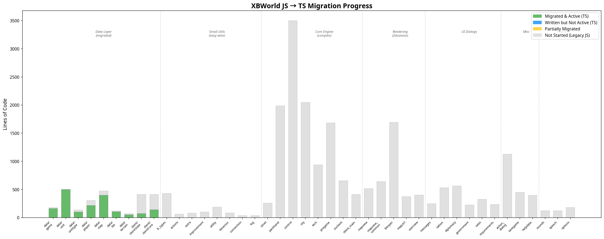

# XBWorld JS → TS 迁移计划

> 最后更新：2026-03-04（Phase 5 网络层修复 + Phase 6 civclient.js 迁移完成后更新）

---

## 1. 当前进度总览



项目共有 **52 个 Legacy JS 文件**（不含第三方库），包含约 **809 个函数**、**25,865 行代码**。此外还有 6 个 2D Canvas 渲染文件（3,675 行）。

当前已迁移到 TypeScript 并激活的模块覆盖了 **21 个模块**，通过 `exposeToLegacy` 暴露了 **163 个函数** 和 **52 个常量**（共 215 个），占 Legacy 函数总数的约 **20.1%**。另有 **13 个 TS 模块**（约 2,152 行）已编写但尚未激活（未被 `main.ts` 导入）。

| 指标 | 数值 |
|---|---|
| Legacy JS 总行数 | ~25,865 |
| Legacy JS 总函数数 | 809 |
| 已迁移 TS 行数（激活） | ~4,224 |
| 已迁移 TS 行数（未激活） | ~2,152 |
| 已覆盖 Legacy 函数数 | 163 (20.1%) |
| 已覆盖 Legacy 常量数 | 52 |
| 已完成 Phase | 1, 2, 3, 4 (webclient.min.js 拆分), 5 (网络层+修复), 6 (civclient.js) |

### 1.1 已迁移并激活的模块

以下模块已通过 `main.ts` 导入，其 `exposeToLegacy` 调用在运行时生效：

| TS 模块 | 对应 Legacy | TS 行数 | 覆盖函数数 | 覆盖常量数 |
|---|---|---|---|---|
| `data/game.ts` | `game.js` | 164 | 8 | 2 |
| `data/unit.ts` | `unit.js` | 498 | 22 | 16 |
| `data/unittype.ts` | `unittype.js` | 101 | 5 | 17 |
| `data/player.ts` | `player.js` | 217 | 18 | 0 |
| `data/map.ts` | `map.js` | 399 | 22 | 6 |
| `data/tile.ts` | `tile.js` | 104 | 10 | 3 |
| `data/terrain.ts` | `terrain.js` | 53 | 3 | 2 |
| `data/fcTypes.ts` | `fc_types.js` | 80 | 0 | 4 |
| `data/actions.ts` | `actions.js` | 45 | 3 | 0 |
| `data/extra.ts` | `extra.js` | 70 | 5 | 4 |
| `data/improvement.ts` | `improvement.js` | 65 | 5 | 1 |
| `data/requirements.ts` | `requirements.js` | 120 | 3 | 2 |
| `data/government.ts` | `government.js` (部分) | 40 | 3 | 0 |
| `data/eventConstants.ts` | `webclient.min.js` (事件常量) | 60 | 0 | 0 |
| `utils/helpers.ts` | `utility.js` | 180 | 13 | 1 |
| `net/packetConstants.ts` | `webclient.min.js` (packet 常量) | 40 | 0 | 0 |
| `net/packhandlers.ts` | `packhand.js` (部分) | 350 | 31 | 0 |
| `net/connection.ts` | `clinet.js` (完整替换) | 206 | 10 | 0 |
| `client/clientState.ts` | `client_main.js` (部分) | 73 | 5 | 3 |
| `client/clientCore.ts` | `civclient.js` (纯逻辑部分) | 246 | 13 | 0 |
| `client/clientTimers.ts` | `civclient.js` (定时器) | 115 | 2 | 0 |
| `client/clientDebug.ts` | `civclient.js` (调试) | 90 | 1 | 0 |

### 1.2 已编写但未激活的模块

这些模块已有 TS 代码但未被 `main.ts` 导入，需要完善后逐步激活：

| TS 模块 | 对应 Legacy | TS 行数 | 状态 |
|---|---|---|---|
| `net/packets.ts` + 子模块 | `packhand.js` | 776 | 需要完善 packet handler |
| `ui/chat.ts` | `messages.js` | 87 | 需要完善 DOM 操作 |
| `ui/controls.ts` | `control.js` (部分) | 147 | 需要完善键盘/鼠标处理 |
| `ui/pregame.ts` | `pregame.js` (部分) | 136 | 需要完善预游戏 UI |
| `ui/statusPanel.ts` | `civclient.js` (部分) | 97 | 需要完善状态面板 |
| `ui/dialogs.ts` | 多个 dialog 文件 | 144 | 需要完善对话框系统 |
| `renderer/PixiRenderer.ts` | 2dcanvas/*.js | 473 | WebGL 渲染器（长期目标） |
| `audio/AudioManager.ts` | `sounds.js` | 86 | 需要完善音频管理 |

---

## 2. 迁移策略

### 2.1 核心原则

迁移采用**渐进式覆盖**策略：Legacy JS 代码保持不变，TS 模块通过 `exposeToLegacy` 逐个替换 `window` 上的函数。这意味着：

1. **只覆盖纯查询/计算函数**，不覆盖初始化函数和编排函数（详见 `MIGRATION_GUIDE.md`）。
2. **返回值格式必须与 Legacy 一致**（snake_case 属性名）。
3. **全局变量从 `window` 读取**，不使用 TS 模块变量。
4. **每次迁移前采集基线日志**，迁移后对比验证（使用 `__TS_DEBUG` 模式）。
5. **本地验证优先**，使用 `vite.config.dev.ts` 连接远程后端测试，确认无误后再部署。

### 2.2 迁移顺序原则

迁移顺序遵循**自底向上、低风险优先**的策略：

1. **先迁移被依赖最多的底层模块**（数据层 → 工具层 → 逻辑层 → UI 层）。
2. **先迁移纯函数**（无副作用、无 DOM 操作），后迁移有副作用的函数。
3. **先迁移小模块**（< 200 行），积累经验后再迁移大模块。
4. **渲染层和 UI 层最后迁移**，因为它们与 DOM 和 jQuery 深度耦合。

---

## 3. 分阶段迁移计划

### Phase 1：完善数据层 ✅ 已完成

**目标**：将所有纯数据模块迁移完成，为上层模块提供类型安全的基础。

**预计工作量**：~1,200 行 TS 代码

| 任务 | Legacy 源 | 行数 | 函数数 | 难度 | 说明 |
|---|---|---|---|---|---|
| 1.1 `data/fcTypes.ts` | `fc_types.js` | 431 | 0 (纯常量) | 低 | 纯常量定义，无函数。迁移为 TS enum/const。 |
| 1.2 `data/actions.ts` | `actions.js` | 61 | 3 | 低 | `action_by_number`, `action_has_result`, `action_prob_possible`。纯查询函数。 |
| 1.3 `data/extra.ts` | `extra.js` | 79 | 5 | 低 | `extra_by_number`, `extra_owner` 等。纯查询函数。 |
| 1.4 `data/improvement.ts` | `improvement.js` | 101 | 6 | 低 | `is_wonder`, `get_improvement_requirements` 等。纯查询函数。 |
| 1.5 `data/government.ts` | `government.js` (数据部分) | ~60 | 3 | 低 | `government_max_rate`, `can_player_get_gov` 等纯查询函数。UI 函数留在 Legacy。 |
| 1.6 `data/requirements.ts` | `requirements.js` | 236 | 4 | 中 | `is_req_active`, `are_reqs_active`。逻辑较复杂但无副作用。 |
| 1.7 完善 `data/terrain.ts` | `terrain.js` | 75 | 4 | 低 | 当前只迁移了 3 个函数，补全剩余 1 个。 |

**验收标准**：所有纯数据查询函数通过 `__TS_DEBUG` 对比验证，零 mismatch。

---

### Phase 2：工具层和网络层 ✅ 已完成

**目标**：迁移工具函数和网络通信层，为核心引擎迁移做准备。

**预计工作量**：~1,500 行 TS 代码

| 任务 | Legacy 源 | 行数 | 函数数 | 难度 | 说明 |
|---|---|---|---|---|---|
| 2.1 `utils/utility.ts` | `utility.js` | 188 | 13 | 低 | `clone`, `DIVIDE`, `FC_WRAP` 等纯工具函数。 |
| 2.2 完善 `utils/bitvector.ts` | `bitvector.js` | 84 | 1 | 低 | 已有 TS 版本，确认覆盖完整。 |
| 2.3 `data/connection.ts` | `connection.js` | 38 | 3 | 低 | 连接数据结构。 |
| 2.4 完善 `net/connection.ts` | `clinet.js` | 259 | 10 | 高 | WebSocket 管理。需要谨慎处理 `network_init`, `websocket_init` 等初始化函数。**只迁移 `send_request`, `send_message` 等纯发送函数**，初始化逻辑留在 Legacy。 |
| 2.5 `data/specialist.ts` | `specialist.js` | 25 | 0 | 低 | 纯数据定义。 |
| 2.6 `data/effects.ts` | `effects.js` | 21 | 0 | 低 | 纯数据定义。 |

**验收标准**：网络发送函数通过端到端测试（本地 dev server 连接远程后端，正常游戏 5 个回合）。

---

### Phase 3：核心引擎 — Packet Handler ✅ 已完成

**目标**：迁移 `packhand.js` 中的 packet handler 函数。这是最大的单个文件（1,986 行，140 个函数），需要分批迁移。

**预计工作量**：~2,500 行 TS 代码

**迁移策略**：`packhand.js` 中的每个 `handle_*` 函数都是独立的 packet 处理器，可以逐个迁移。按照 packet 类型分组：

| 任务 | 函数组 | 函数数 | 难度 | 说明 |
|---|---|---|---|---|
| 3.1 Ruleset handlers | `handle_ruleset_*` | ~25 | 中 | 接收服务器规则集数据，存入全局变量。纯数据存储，适合迁移。 |
| 3.2 Map/Tile handlers | `handle_tile_info`, `handle_map_info`, `handle_set_topology` | ~5 | 中 | 地图数据处理。依赖 Phase 1 的数据层。 |
| 3.3 Unit handlers | `handle_unit_*` | ~10 | 中 | 单位数据处理。 |
| 3.4 City handlers | `handle_city_*` | ~8 | 中 | 城市数据处理。 |
| 3.5 Player handlers | `handle_player_*` | ~5 | 中 | 玩家数据处理。 |
| 3.6 Game state handlers | `handle_game_info`, `handle_start_phase`, `handle_begin_turn` 等 | ~15 | 高 | 游戏状态变更，有副作用（调用 UI 更新）。**只迁移数据处理部分**，UI 调用保留为 `legacy.xxx()` 调用。 |
| 3.7 其余 handlers | 剩余 ~70 个 | ~70 | 中 | 逐批迁移。 |

**验收标准**：每批 handler 迁移后，通过完整游戏流程测试（开始 → 5 回合 → 保存 → 加载 → 再玩 5 回合）。

---

### Phase 4：webclient.min.js 拆分 ✅ 已完成

**目标**：将 `webclient.min.js` 拆分为独立的模块文件，使 Legacy JS 可以逐个被 TS 替换。

**实际完成内容**：
- 从 `webclient.min.js` 中拆分出 `packhand_glue.js`、`client_main.js`、`clinet.js` 等独立文件
- 在 `index.html` 中按正确顺序加载拆分后的文件和 TS bundle

---

### Phase 5：网络层完整替换 + 关键修复 ✅ 已完成

**目标**：完全替换 `clinet.js`（网络层），修复 Phase 4 拆分后遗留的运行时问题。

**实际完成内容**：
- `net/connection.ts` 完全替换 `clinet.js`（WebSocket 管理、packet 收发）
- 修复 packet 常量缺失：创建 `net/packetConstants.ts`（从 `webclient.min.js` 提取 `packet_*` 常量）
- 修复事件常量缺失：创建 `data/eventConstants.ts`（从 `webclient.min.js` 提取 `E_*` 常量）
- 修复 WebGL stub 函数缺失：在 `main.ts` 中添加 `webgl_canvas_pos_to_tile` 等 stub
- 修复 `update_client_state` 未暴露到 window：将 TS 中的 `w.update_client_state()` 改为 `w.set_client_state()`
- 修复 `utype_actions` BitVector 转换缺失：在 `packhandlers.ts` 中添加 `handle_web_ruleset_unit_addition` 的 BitVector 转换

**踩坑记录**：
1. `webclient.min.js` 拆分后，部分全局变量（packet 常量、事件常量）只在 `webclient.min.js` 内部定义，拆分后丢失
2. `update_client_state` 是 `packhand.js` 中的局部函数，不在 `window` 上，TS 通过 `w.update_client_state()` 调用会静默失败（被 try-catch 吞掉）
3. WebGL 相关函数在 2D Canvas 模式下不存在，但 `overview.js` 等文件会引用它们

---

### Phase 6：civclient.js 纯逻辑函数迁移 ✅ 已完成

**目标**：将 `civclient.js` 中的纯逻辑函数迁移到 TypeScript，减少 Legacy JS 代码量。

**实际完成内容**：
- `civclient.js` 从 648 行减少到 480 行（-26%）
- 迁移了 13 个函数到 3 个 TS 模块：

| TS 模块 | 迁移的函数 | 行数 |
|---|---|---|
| `client/clientCore.ts` | `validate_username`, `is_username_valid_show`, `surrender_game`, `show_fullscreen_window`, `motd_init` (新增到已有的 `is_longturn`, `is_pbem`, `is_hotseat`, `is_server`, `set_phase_start`, `request_observe_game`, `send_surrender_game`, `get_invalid_username_reason`) | 246 |
| `client/clientTimers.ts` (新) | `update_timeout`, `update_turn_change_timer` | 115 |
| `client/clientDebug.ts` (新) | `show_debug_info` | 90 |

**保留在 Legacy JS 中的函数**（重度 jQuery UI 依赖）：
- `civclient_init` — 初始化函数，大量 jQuery UI 设置
- `init_common_intro_dialog` — 根据游戏类型显示不同的欢迎对话框
- `close_dialog_message` / `closing_dialog_message` / `show_dialog_message` — 通用消息对话框
- `show_auth_dialog` — 密码认证对话框
- `switch_renderer` — 2D/3D 渲染器切换

**验收标准**：完整游戏流程测试通过（登录 → pregame → 自动进入 RUNNING → 地图渲染正确）。

---

### Phase 7：核心引擎 — 城市和科技（下一步）

**目标**：迁移城市管理和科技树的数据逻辑。

**预计工作量**：~2,000 行 TS 代码

| 任务 | Legacy 源 | 行数 | 函数数 | 难度 | 说明 |
|---|---|---|---|---|---|
| 7.1 `data/city.ts` (数据部分) | `city.js` | ~800 | ~30 | 高 | `city_tile`, `city_owner`, `is_city_center`, `city_has_building`, `can_city_build_*` 等纯查询函数。UI 函数（`show_city_dialog` 等）留在 Legacy。 |
| 7.2 `data/tech.ts` (数据部分) | `tech.js` | ~300 | ~10 | 中 | `player_invention_state`, `is_tech_req_for_*`, `tech_id_by_name` 等纯查询函数。UI 函数留在 Legacy。 |
| 7.3 `data/nation.ts` | `nation.js` (数据部分) | ~100 | ~5 | 低 | 国家数据查询函数。 |

**验收标准**：城市对话框、科技树界面功能完整，无 NaN/undefined 显示。

---

### Phase 8：控制层（长期）

**目标**：迁移 `control.js` 中的核心控制逻辑。这是最大最复杂的模块（3,503 行，96 个函数），需要非常谨慎。

**预计工作量**：~3,000 行 TS 代码

**迁移策略**：按功能分组，只迁移纯逻辑函数，键盘/鼠标事件处理留在 Legacy：

| 任务 | 函数组 | 函数数 | 难度 | 说明 |
|---|---|---|---|---|
| 8.1 单位焦点管理 | `update_unit_focus`, `advance_unit_focus`, `set_unit_focus` 等 | ~10 | 高 | 核心游戏逻辑，有复杂的状态管理。 |
| 8.2 单位命令 | `key_unit_*` 系列 | ~25 | 中 | 单位操作命令。每个函数相对独立。 |
| 8.3 Goto 路径 | `activate_goto`, `request_goto_path`, `update_goto_path` | ~5 | 高 | 路径规划逻辑。 |
| 8.4 地图点击处理 | `do_map_click`, `ask_server_for_actions` | ~5 | 高 | 核心交互逻辑。 |
| 8.5 Action 决策 | `action_decision_*`, `action_selection_*` | ~10 | 高 | 动作选择逻辑。 |
| 8.6 其余控制函数 | 剩余 ~40 个 | ~40 | 中-高 | 逐批迁移。 |

**验收标准**：完整游戏操作测试（移动单位、建城、攻击、外交等）。

---

### Phase 9：渲染层（长期）

**目标**：迁移 2D Canvas 渲染管线。

**预计工作量**：~3,500 行 TS 代码

| 任务 | Legacy 源 | 行数 | 函数数 | 难度 | 说明 |
|---|---|---|---|---|---|
| 9.1 `renderer/tilespec.ts` | `tilespec.js` | 1,694 | 58 | 高 | Tileset 配置和 sprite 查找。核心渲染数据。 |
| 9.2 `renderer/mapview.ts` | `mapview.js` | 518 | 17 | 高 | 地图视图渲染。 |
| 9.3 `renderer/mapviewCommon.ts` | `mapview_common.js` | 642 | 22 | 高 | 地图视图通用逻辑。 |
| 9.4 `renderer/mapctrl.ts` | `mapctrl.js` | 374 | 12 | 中 | 地图控制（拖拽、缩放）。 |
| 9.5 `renderer/overview.ts` | `overview.js` | 401 | 10 | 中 | 小地图渲染。 |

**验收标准**：地图渲染性能不低于 Legacy 版本，所有地形/单位/城市正确显示。

---

### Phase 10：UI 层（长期 → 最终）

**目标**：迁移所有 UI 对话框和界面组件。这是最后一步，因为 UI 代码与 jQuery/DOM 深度耦合，迁移时可能需要引入现代 UI 框架。

**预计工作量**：~5,000 行 TS 代码

| 任务 | Legacy 源 | 行数 | 难度 | 说明 |
|---|---|---|---|---|
| 10.1 城市对话框 | `city.js` (UI 部分) | ~1,200 | 高 | jQuery UI dialog |
| 10.2 科技树 UI | `tech.js` (UI 部分) | ~600 | 高 | Canvas 绘制 + jQuery |
| 10.3 预游戏 UI | `pregame.js` | 1,683 | 高 | 大量 DOM 操作 |
| 10.4 外交对话框 | `diplomacy.js` | 564 | 中 | jQuery dialog |
| 10.5 Action 对话框 | `action_dialog.js` | 1,128 | 高 | 复杂的动作选择 UI |
| 10.6 国家界面 | `nation.js` | 532 | 中 | 表格 + jQuery |
| 10.7 其余 UI | `rates.js`, `helpdata.js`, `savegame.js` 等 | ~2,000 | 中 | 各种辅助 UI |
| 10.8 消息系统 | `messages.js` | 249 | 低 | 聊天框 UI |

**验收标准**：所有 UI 功能与 Legacy 版本一致，无视觉回归。

---

## 4. 里程碑时间线

| 里程碑 | Phase | 预计 TS 行数 | 累计覆盖率 | 关键交付物 |
|---|---|---|---|---|
| **M1: 数据层完成** ✅ | Phase 1 | ~1,200 | ~20% | 所有纯数据查询函数迁移完成 |
| **M2: 工具+网络层完成** ✅ | Phase 2 | ~1,500 | ~28% | 网络发送函数可用，工具函数类型安全 |
| **M3: Packet Handler 完成** ✅ | Phase 3 | ~2,500 | ~45% | 所有 packet 处理器迁移完成 |
| **M3.5: webclient.min.js 拆分** ✅ | Phase 4 | — | ~45% | Legacy JS 可逐个替换 |
| **M4: 网络层完整替换** ✅ | Phase 5 | ~500 | ~47% | clinet.js 完全由 TS 替换 |
| **M5: civclient.js 迁移** ✅ | Phase 6 | ~450 | ~49% | civclient.js 纯逻辑函数迁移完成 |
| **M6: 城市+科技数据完成** | Phase 7 | ~2,000 | ~55% | 城市和科技的数据逻辑迁移完成 |
| **M7: 控制层完成** | Phase 8 | ~3,000 | ~70% | 核心游戏控制逻辑迁移完成 |
| **M8: 渲染层完成** | Phase 9 | ~3,500 | ~85% | 2D Canvas 渲染管线迁移完成 |
| **M9: UI 层完成** | Phase 10 | ~5,000 | ~100% | 全部迁移完成，可移除 Legacy JS |

---

## 5. 每次迁移的标准流程

每个迁移任务（无论大小）都必须遵循以下流程：

```
1. 阅读 MIGRATION_GUIDE.md 和 MIGRATION_PITFALLS.md
2. 阅读 Legacy 源码，记录函数签名、返回值格式、副作用
3. 分类函数（纯查询 / 初始化 / 编排 / UI）
4. 启用 __TS_DEBUG，采集基线日志（__TS_SNAPSHOT_START）
5. 编写 TS 代码，添加 exposeToLegacy
6. 运行 tsc + vitest + vite build
7. 本地 dev server 测试（./scripts/dev.sh）
8. 采集迁移后日志，diff 对比基线
9. 确认零 mismatch 后提交
10. 部署到 Railway 验证
11. 更新 MIGRATION_PITFALLS.md（如有新踩坑）
12. 更新本文档的进度表
```

---

## 6. 风险和注意事项

### 6.1 高风险模块

以下模块迁移风险最高，需要特别谨慎：

| 模块 | 风险原因 | 缓解措施 |
|---|---|---|
| `packhand.js` | 140 个函数，是所有数据流的入口 | 分批迁移，每批 5-10 个 handler |
| `control.js` | 96 个函数，核心交互逻辑 | 只迁移纯逻辑，事件处理留在 Legacy |
| `tilespec.js` | 58 个函数，渲染核心 | 迁移前做性能基准测试 |
| `city.js` | 70 个函数，数据+UI 混合 | 严格分离数据函数和 UI 函数 |

### 6.2 jQuery 依赖

当前 Legacy 代码大量使用 jQuery 和 jQuery UI（对话框、表格排序、滑块等）。UI 层迁移时需要决定：

- **方案 A**：保持 jQuery，TS 中通过类型声明使用。
- **方案 B**：逐步替换为原生 DOM API + 轻量级 UI 库。
- **方案 C**：引入 React/Preact 等现代框架（大规模重构）。

建议 Phase 1-8 采用方案 A（最低风险），Phase 10 时根据实际情况决定。

### 6.3 webclient.min.js

`webclient.min.js` 是所有 Legacy JS 文件的合并压缩版本。Phase 4 已将其拆分为独立文件。后续迁移中，每个拆分出的文件可以逐个被 TS 替换。

### 6.4 Phase 5 踩坑总结

Phase 5 修复过程中发现了几个重要的架构问题：

1. **全局变量丢失**：`webclient.min.js` 拆分后，部分全局变量（packet 常量 `packet_*`、事件常量 `E_*`）只在合并文件内部定义，拆分后丢失。解决方案：创建独立的 TS 常量模块。
2. **局部函数不可访问**：`update_client_state` 是 `packhand.js` 中的局部函数，不在 `window` 上。TS 通过 `w.update_client_state()` 调用会静默失败（被 try-catch 吞掉）。解决方案：改为调用 `w.set_client_state()`。
3. **WebGL 函数缺失**：2D Canvas 模式下 WebGL 相关函数不存在，但 `overview.js` 等文件会引用它们。解决方案：在 `main.ts` 中添加 stub 函数。
4. **BitVector 转换缺失**：`handle_web_ruleset_unit_addition` 中的 `utype_actions` 需要从数组转换为 BitVector 对象。

---

## 7. 文件索引

| 文件 | 用途 |
|---|---|
| `docs/MIGRATION_PLAN.md` | 本文档（迁移计划和进度跟踪） |
| `docs/MIGRATION_GUIDE.md` | 迁移操作手册（编码规则、测试流程） |
| `docs/MIGRATION_PITFALLS.md` | 踩坑记录（每次踩坑后更新） |
| `docs/migration_progress.png` | 迁移进度可视化图表 |
| `vite.config.dev.ts` | 本地开发配置 |
| `scripts/dev.sh` | 本地开发启动脚本 |
